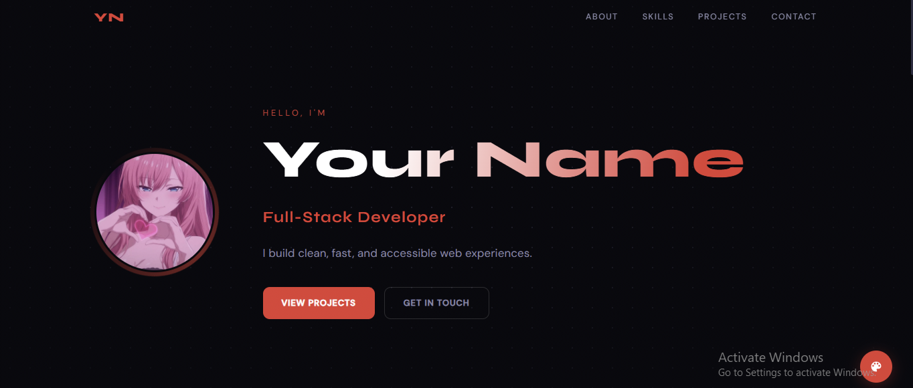

# Developer Porfolio 

A clean, dark-themed developer portfolio template — zero dependencies, no build tools, pure HTML/CSS/JS. Just edit one config object and ship.
---
[](https://dev-sae.vercel.app)
---

## ✨ Features

- **Zero dependencies** — no npm, no bundler, no framework
- **One-file config** — everything lives in `script.js` → `CONFIG`
- **Discord avatar support** — paste your User ID, done (uses Lanyard)
- **Local avatar** — drop `assets/avatar.png`, done
- **Working contact form** — powered by [Formspree](https://formspree.io) (free)
- **Live colour palette** — 8 presets + custom hex picker, persists via `localStorage`
- **Fully responsive** — mobile, tablet, and desktop
- **Red default accent** — easily changeable via the widget or config
- **Accessible** — semantic HTML, ARIA labels, keyboard navigation

---

## 🚀 Quick Start

```bash
git clone https://github.com/yourusername/dark-devfolio.git
cd dark-devfolio
# Open index.html in your browser — no server needed for local preview
```

> For the contact form and Discord avatar to work, you need to serve the file over HTTP (e.g. VS Code Live Server, or deploy to Vercel/Netlify/GitHub Pages).

---

## ⚙️ Setup Guide

Open **`script.js`** and edit the `CONFIG` object at the top. All personalisation lives there.

### 1 — Basic Info

```js
siteTitle: "Jane Doe — Developer Portfolio",
navLogo:   "JD",           // initials shown in top-left navbar

heroGreeting: "Hello, I'm",
heroName:     "Jane Doe",
heroRole:     "Full-Stack Developer",
heroTagline:  "I build clean, fast, and accessible web experiences.",
```

---

### 2 — Profile Picture

Set `avatarMode` to one of the options below:

#### Option A — Local file *(recommended for custom images)*
```js
avatarMode:      "local",
localAvatarPath: "assets/avatar.png",  // drop your photo here
```
Place your photo at `assets/avatar.png` next to `index.html`.

#### Option B — Discord (auto-fetch via Lanyard) *(easiest if you use Discord)*
```js
avatarMode:    "discord-lanyard",
discordUserId: "123456789012345678",   // your Discord User ID only
```
Steps:
1. Enable Developer Mode in Discord: **Settings → Advanced → Developer Mode**
2. Right-click your name → **Copy User ID**
3. Join the Lanyard tracking server: [discord.gg/lanyard](https://discord.gg/lanyard)

#### Option C — Custom URL
```js
avatarMode:   "custom",
customPfpUrl: "https://i.imgur.com/YOURIMAGE.png",
```

#### Option D — Initials fallback
```js
avatarMode:      "initials",
avatarInitials:  "JD",
```

---

### 3 — About Section

```js
aboutParagraph1: "Your first paragraph...",
aboutParagraph2: "Your second paragraph...",

factYears:    "3+",
factProjects: "20+",
factCoffee:   "∞",
```

---

### 4 — Skills

Add, remove, or reorder freely. The `icon` key must exist in `SKILL_ICONS`:

```js
skills: [
  { icon: "html",       name: "HTML" },
  { icon: "css",        name: "CSS" },
  { icon: "javascript", name: "JavaScript" },
  { icon: "react",      name: "React" },
  { icon: "typescript", name: "TypeScript" },
  { icon: "nodejs",     name: "Node.js" },
  { icon: "python",     name: "Python" },
  { icon: "git",        name: "Git" },
  // ...
],
```

**Available icon keys:** `html` · `css` · `javascript` · `typescript` · `react` · `nodejs` · `git` · `docker` · `figma` · `python` · `database` · `terminal`

---

### 5 — Projects

```js
projects: [
  {
    tag:  "Web App",                // small category label
    name: "My Project",
    desc: "Short description of what it does.",
    tech: ["React", "Node.js"],    // badge labels
    link: "https://github.com/...", // "" to hide the button
  },
],
```

---

### 6 — Contact Form *(Formspree — free)*

The form sends emails to your inbox — no backend required.

1. Sign up at [formspree.io](https://formspree.io) (free tier is enough)
2. Click **New Form**, name it, and copy your **Form ID** (e.g. `xpzgkdqb`)
3. Set it in `CONFIG`:

```js
formspreeId:  "xpzgkdqb",        // ← your Formspree Form ID
contactEmail: "you@example.com", // shown as a direct email link
```

If `formspreeId` is left empty (`""`), the form is replaced with a plain **Open Email Client** button.

---

### 7 — Social Links

```js
socials: [
  { label: "GitHub",   icon: "github",   url: "https://github.com/yourusername" },
  { label: "LinkedIn", icon: "linkedin", url: "https://linkedin.com/in/yourusername" },
  { label: "Discord",  icon: "discord",  url: "https://discord.com/users/youruserid" },
  { label: "Twitter",  icon: "twitter",  url: "https://x.com/yourusername" },
  { label: "Website",  icon: "website",  url: "https://yourwebsite.com" },
],
```

Remove any entry to hide it. **Supported icons:** `github` · `linkedin` · `twitter` · `discord` · `website`

---

### 8 — Accent Colour

Default is **red** (`#e53935`). To permanently change it:

```js
accentColor: "#e53935",  // any valid CSS hex
```

Users can also change it live via the 🎨 widget in the bottom-right corner. Their choice is saved in `localStorage`.

---

## 🗂 File Structure

```
dark-devfolio/
├── index.html          ← HTML structure (sections, form)
├── style.css           ← All styles + responsive breakpoints
├── script.js           ← CONFIG + all logic (edit this to personalise)
├── assets/
│   └── avatar.png      ← Drop your profile photo here
└── README.md
```

---

## 🌍 Deployment

This is a static site — deploy anywhere:

| Platform | How |
|---|---|
| **Vercel** | `vercel --prod` or drag & drop the folder |
| **Netlify** | Drag & drop the folder at app.netlify.com |
| **GitHub Pages** | Push to `main`, enable Pages in repo Settings |
| **Cloudflare Pages** | Connect repo, set output to `/` |

---

## 🔧 Required Steps Checklist

- [ ] Edit `heroName`, `heroRole`, `heroTagline` in `CONFIG`
- [ ] Set your `contactEmail`
- [ ] Choose an `avatarMode` and configure it
- [ ] Update `socials` with your real links
- [ ] Add your real projects to the `projects` array
- [ ] Set up Formspree and add your `formspreeId` (or leave blank)
- [ ] **Do not remove the footer credits**

---

## 📜 Credits & License

```
Made with ❤️ by sae.py | SynthX Development · © 2026
```

This portfolio template is **free to use and modify** for personal and commercial use, provided:

- ✅ You may change your name, content, colours, and projects freely.
- ✅ You may deploy and publish this portfolio publicly.
- ❌ **You must not remove or modify the footer credit line** (`Made with ❤️ by sae.py | SynthX Development`).
- ❌ You must not claim authorship of the original template design.

The footer credit is small, unobtrusive, and the only thing asked in return for a free, well-crafted template. Please respect it.

---

<div align="center">
  Made with ❤️ by <strong>sae.py</strong> | SynthX Development &nbsp;·&nbsp; © 2026
</div>
